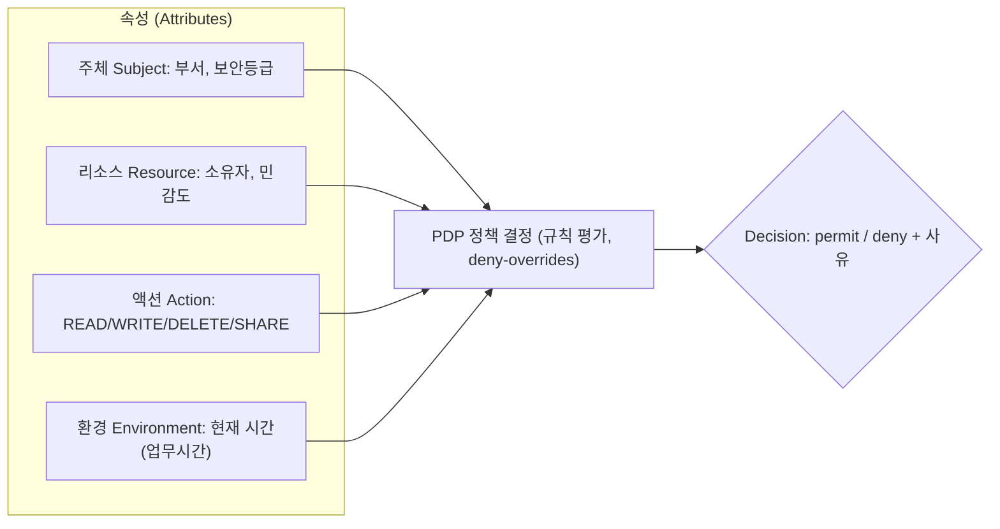
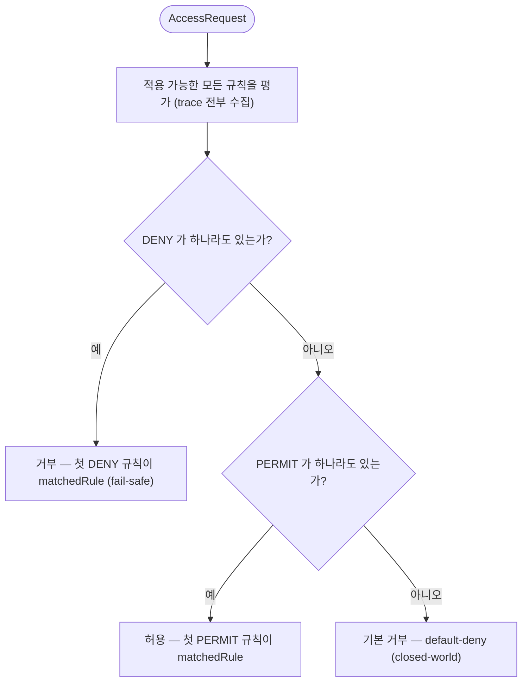
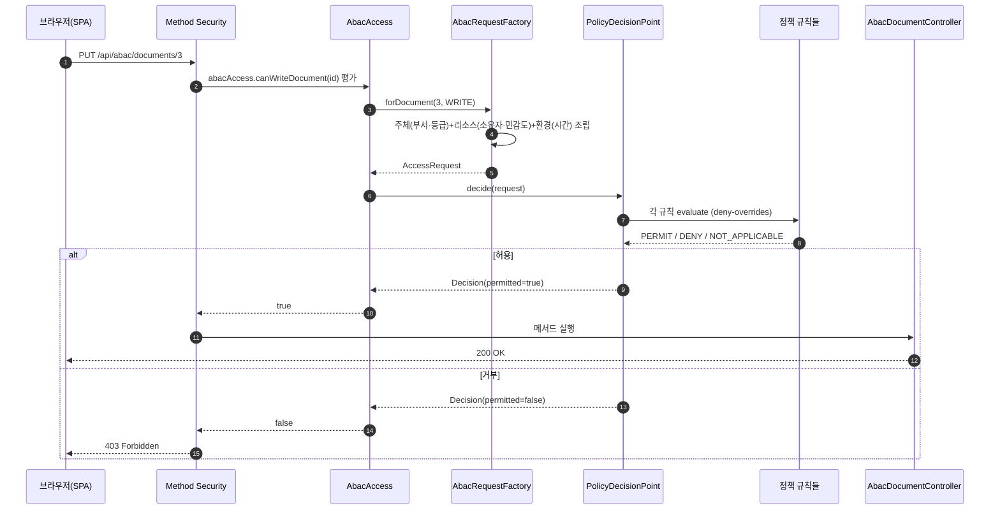

# ABAC (Attribute-Based Access Control, 속성 기반 접근 제어)

> 이 문서는 본 스터디 프로젝트의 **Stage 2 — ABAC** 구현을 설명합니다.
> 코드와 1:1로 대응하며, 다이어그램은 [mermaid](https://mermaid.js.org/)로 그렸습니다.
> 같은 도메인의 **Stage 1 — RBAC** 는 [`rbac.md`](./rbac.md) 를 참고하세요.

---

## 1. ABAC란?

**ABAC**는 인가 결정을 미리 정해진 역할이 아니라 **속성(Attribute)** 들의 **정책(Policy) 평가**로 내리는 모델입니다.
RBAC가 "이 사람의 **역할**이 무엇인가?"를 물었다면, ABAC는 "이 **주체**가 이 **리소스**에 이 **액션**을, 지금 이 **환경**에서 해도 되는가?"를 묻습니다.

네 가지 속성 범주(ABAC의 4요소)를 정책이 함께 본다는 점이 핵심입니다.



### 표준 용어 (PEP/PDP/PIP/PAP)

| 약어 | 의미 | 이 프로젝트의 대응 |
|------|------|--------------------|
| **PEP** (Enforcement) | 결정을 **강제**하는 지점 | `@PreAuthorize("@abacAccess...")` (컨트롤러) |
| **PDP** (Decision) | 정책을 평가해 **결정**하는 엔진 | `PolicyDecisionPoint` |
| **PIP** (Information) | 속성을 **공급**하는 곳 | `AbacRequestFactory`(+ `EnvironmentAttributeProvider`) |
| **PAP** (Administration) | 정책을 **정의·관리**하는 곳 | `policy/*Rule` (정책 규칙 객체들) |

### RBAC와의 결정적 차이

- RBAC의 `hasAuthority('document:write')`는 **어떤 문서든 같은 답**을 줍니다(권한은 리소스와 무관).
- ABAC의 `@abacAccess.canWriteDocument(#id)`는 **그 문서의 속성**(소유자·민감도)과 **주체 속성**(부서·등급), **환경**(시간)에 따라 답이 **문서마다·시간마다 갈립니다**(per-resource, context-aware).

---

## 2. 정책 모델 — 규칙 객체 + deny-overrides

ABAC를 "if 문 뭉치"가 아니라 **정책의 모음**으로 보이게 하기 위해, 각 규칙을 `PolicyRule` 인터페이스의 구현(`@Component`)으로 두고 Spring이 `List<PolicyRule>`로 PDP에 주입합니다. 새 정책은 **파일 하나**만 추가하면 됩니다(PDP·컨트롤러 무수정).

### 2.1 규칙 카탈로그

| 규칙 (ruleId) | 적용 액션 | 로직 (owner = 주체 id == 리소스 ownerId) | 효과 |
|---|---|---|---|
| `owner-rule` | 전부 | 소유자 본인이면 허용 | owner → **PERMIT**, 아니면 NOT_APPLICABLE |
| `clearance-dominance` | 전부 | 소유자 면제. 아니면 `등급 ≥ 민감도` | 충족 → **PERMIT**, 미달 → **DENY** |
| `same-department` | 전부 | 소유자 면제. 아니면 `주체 부서 == 소유자 부서` | 일치 → **PERMIT**, 불일치 → **DENY** |
| `business-hours` | WRITE/DELETE/SHARE | 평일 09–18시 (READ 제외) | 업무시간 → 통과, 시간외 → **DENY**(소유자도 적용) |

> **owner 면제의 의미**: 소유자는 등급·부서 규칙에서 면제(NOT_APPLICABLE)되어 자기 문서엔 자유롭게 접근합니다. 단 **업무시간 규칙은 소유자에게도 적용**되므로 — deny-overrides와 결합해 — "소유자여도 업무시간 외 수정은 거부"가 성립합니다. **환경이 소유를 이기는** 이 장면이 RBAC가 표현조차 못 하는 ABAC의 강점입니다.
>
> **리소스에는 부서 컬럼이 없습니다.** `same-department`가 비교하는 리소스 부서는 **소유자의 부서**로 파생합니다(`AbacRequestFactory.departmentOf`).

### 2.2 조합 알고리즘 — deny-overrides (XACML 표준 조합자)



- **하나라도 DENY → 거부** (보안 fail-safe). 순서에 무관해 추론이 쉽습니다.
- DENY 없고 PERMIT 있으면 허용. 둘 다 없으면(전부 NOT_APPLICABLE) **기본 거부**.
- PDP는 단락하지 않고 **모든 규칙을 끝까지 평가**해 `trace`에 담습니다 → 프런트의 "왜(why)" 패널이 "owner는 통과했지만 업무시간에서 막혔다"를 동시에 보여줍니다.

---

## 3. 인가 결정 흐름 (PEP → PDP)

`@PreAuthorize`가 **enforcement**(PEP), `PolicyDecisionPoint`가 **decision**(PDP)입니다. 두 길(enforcement와 설명 엔드포인트)이 **같은 `decide()`** 를 거치므로 "설명 = 실제"가 보장됩니다(RBAC의 `AccessDecisionExplainer`와 같은 사상).



### 왜 SpEL 빈 참조인가 (`@abacAccess.canWriteDocument(#id)`)

표준 관용구인 커스텀 `PermissionEvaluator`(`hasPermission(#id, 'Document', 'write')`)를 **일부러 쓰지 않았습니다**. 6장의 학습 노트에서 그 이유(Spring Security 7에서 RoleHierarchy 자동설정이 깨지는 문제)를 다룹니다.

---

## 4. RBAC vs ABAC (같은 도메인, 다른 인가)

| 측면 | RBAC (Stage 1) | ABAC (Stage 2) |
|------|----------------|----------------|
| 결정 기준 | 역할/권한 보유 여부 | 주체·리소스·환경 **속성** + 정책 |
| 리소스 의존성 | 없음 (`document:read`는 모든 문서 동일) | **있음** (그 문서의 소유자·민감도를 본다) |
| 문서 목록 | VIEWER면 **전부** 반환 | `등급 ≥ 민감도`인 **읽을 수 있는 것만** 필터 |
| 시간/컨텍스트 조건 | **표현 불가** | `business-hours` 규칙으로 표현 |
| "같은 부서만" | 부서×액션마다 역할 → **역할 폭발** | 속성 규칙 **한 줄** |
| 디버깅 | 권한 목록 확인(단순) | 규칙 `trace` 확인(상대적으로 복잡) |
| 엔드포인트 | `/api/rbac/*` | `/api/abac/*` (재시작 없이 나란히 비교) |

> **사유 충돌로 보는 차이**: 같은 carol(VIEWER, LEGAL, 등급 2)에게 문서1(ENG, 민감도 3)을 물으면 — RBAC 결정 설명은 "`document:read` 보유 → 허용", ABAC 결정 설명은 "부서 LEGAL ≠ ENG → 거부 / 등급 2 < 민감도 3 → 거부". 같은 화면에서 두 모델의 사유 문자열이 충돌하는 것을 직접 볼 수 있습니다.

---

## 5. 결정 매트릭스 (시드 기준)

주체: **alice**(ENG, 등급5) · **bob**(ENG, 등급3) · **carol**(LEGAL, 등급2) · **dave**(ENG, 등급3)
문서: **D1** API Design(소유 bob/ENG, 민감도3) · **D2** Roadmap(소유 alice/ENG, 민감도2) · **D3** NDA(소유 carol/LEGAL, 민감도4)

### 5.1 읽기(READ) — 업무시간 무관

| 주체 | D1 (ENG,3) | D2 (ENG,2) | D3 (LEGAL,4) | 거부 사유(예) |
|------|:---:|:---:|:---:|------|
| alice (ENG,5) | ✅ | ✅ 소유 | ❌ | D3: 부서 ENG ≠ LEGAL |
| bob (ENG,3) | ✅ 소유 | ✅ | ❌ | D3: 등급 3 < 4 + 부서 불일치 |
| carol (LEGAL,2) | ❌ | ❌ | ✅ 소유 | D1: 등급 2 < 3 + 부서 / D2: 부서 |
| dave (ENG,3) | ✅ | ✅ | ❌ | D3: 등급 3 < 4 + 부서 |

→ `GET /api/abac/documents` 목록 길이: carol = **1**(D3만), alice/bob/dave = **2**(D1·D2). 같은 carol의 `GET /api/rbac/documents`는 **3**(전부). **이것이 행 단위 필터링의 핵심 대조입니다.**

### 5.2 쓰기(WRITE) — 업무시간 적용

| 주체 → 문서 | 업무시간(평일 09–18) | 시간외 | 비고 |
|------|:---:|:---:|------|
| carol → D3 (소유) | ✅ | ❌ | 시간외: `business-hours` 규칙이 소유자도 거부 |
| alice → D2 (소유) | ✅ | ❌ | 동일 |
| alice → D3 | ❌ | ❌ | 부서 규칙으로 항상 거부(시간 무관) |

> **같은 주체·같은 문서**라도 **시간**만으로 ✅↔❌ 가 바뀌는 것(carol → D3 WRITE)이 ABAC의 환경 속성을 가장 선명히 보여줍니다 — RBAC로는 불가능합니다.

---

## 6. 코드 위치 (학습용 매핑)

| 개념 | 파일 |
|------|------|
| 액션 + 업무시간 적용 여부 | `backend/.../abac/AbacAction.java` |
| 요청/결정 모델(속성·trace) | `backend/.../abac/model/{AccessRequest,Subject,Resource,Environment,Decision,RuleEvaluation,Effect}.java` |
| 환경(시간) 공급원 | `backend/.../abac/env/EnvironmentAttributeProvider.java` (+ `SystemEnvironmentAttributeProvider`) |
| **정책 규칙(PAP)** | `backend/.../abac/policy/{PolicyRule,OwnerRule,ClearanceDominanceRule,SameDepartmentRule,BusinessHoursRule}.java` |
| **PDP (deny-overrides)** | `backend/.../abac/PolicyDecisionPoint.java` |
| 속성 조립(PIP) | `backend/.../abac/AbacRequestFactory.java` |
| **PEP 진입점(SpEL 빈)** | `backend/.../abac/AbacAccess.java` |
| 도메인 로직 + 목록 필터/설명 | `backend/.../abac/{AbacDocumentService,AbacFolderService}.java` |
| `@PreAuthorize` 인가 매트릭스 | `backend/.../web/{AbacDocumentController,AbacFolderController}.java` |
| 결정 DTO(trace 포함) | `backend/.../web/dto/{AbacDecisionDto,RuleTraceDto,AbacResourceDecisionsDto}.java` |
| 허용/거부·시간·필터 테스트 | `backend/src/test/.../abac/AbacAuthorizationTest.java` |
| 프런트 데모(결정-추적 패널) | `frontend/src/pages/AbacDemoPage.tsx` |

### 학습 노트 — 왜 커스텀 `PermissionEvaluator`를 쓰지 않았나

표준 관용구는 `@PreAuthorize("hasPermission(#id, 'Document', 'write')")` + 커스텀 `PermissionEvaluator`입니다. 그러나 이를 등록하려면 **커스텀 `MethodSecurityExpressionHandler` 빈**을 정의해야 하는데, Spring Security **7.0.x** 에서 그 순간 프레임워크가 `RoleHierarchy`를 자동 주입하던 내부 핸들러가 사용자 빈으로 **교체되어 RBAC 역할 계층(ADMIN>EDITOR>VIEWER)이 깨집니다**(복구하려면 `AuthorizationManagerFactory`에 RoleHierarchy를 수동 주입해야 함).

→ 그래서 **메서드 보안 설정을 전혀 건드리지 않는 SpEL 빈 참조**(`@abacAccess.canWriteDocument(#id)`)를 택했습니다. 기존 RBAC 13개 테스트와 RoleHierarchy 자동설정이 그대로 보존되고, "애너테이션이 리소스 id를 받아 그 리소스의 속성을 본다"는 ABAC의 전환도 가장 선명하게 드러납니다.

---

## 7. 직접 해보기

```bash
# 백엔드 (전역 java 없음 → 환경변수 export)
export JAVA_HOME=/opt/homebrew/opt/openjdk@21/libexec/openjdk.jdk/Contents/Home
export PATH="/opt/homebrew/opt/openjdk@21/bin:$PATH"
cd backend && ./gradlew bootRun      # :8080

# 프런트 (다른 터미널)
cd frontend && npm run dev            # :5173 (/api 프록시 → :8080)
```

**시나리오**: `:5173`의 **ABAC 데모** 화면에서 유저를 **carol → bob → alice** 로 전환하며, 각 문서의 **정책 결정표**(행 클릭 시 규칙 `trace` 펼침)와 **라이브 시도**(실제 HTTP 상태)를 대조하세요. 같은 문서를 **RBAC 데모** 화면과 비교하면 두 모델의 차이가 한눈에 들어옵니다.

| 확인 포인트 | 기대 |
|------|------|
| carol 의 ABAC 문서 목록 | **1건**(D3) — RBAC 목록은 3건 |
| alice 가 D3(NDA) 읽기 | ⛔ 403 (등급은 충분, **부서**로 거부) |
| carol 가 본인 D3 수정 | 업무시간 ✅ 200 / 시간외 ⛔ 403 (**환경**이 소유를 이김) |
| carol 가 본인 D3 읽기 | 시간 무관 ✅ 200 (READ는 업무시간 규칙 미적용) |

```bash
# 빠른 확인용 curl — ABAC 목록은 carol 에게 1건만 반환된다(RBAC는 3건)
curl -s -c /tmp/c.txt -d "username=carol&password=password" http://localhost:8080/api/login
curl -s -b /tmp/c.txt http://localhost:8080/api/abac/documents | jq 'length'          # → 1
curl -s -b /tmp/c.txt http://localhost:8080/api/rbac/documents | jq 'length'          # → 3
# 결정 설명: 거부 사유(규칙 trace)까지 200 으로 받아 본다(인가 우회 아님)
curl -s -b /tmp/c.txt http://localhost:8080/api/abac/documents/1/decisions | jq '.decisions[0]'
```

> 업무시간 규칙은 **서버의 실제 시간**(`SystemEnvironmentAttributeProvider`)을 사용합니다. 평일 업무시간에 띄우면 쓰기가 통과하고, 야간/주말이면 거부됩니다. 테스트(`AbacAuthorizationTest`)는 `EnvironmentAttributeProvider`를 `@MockitoBean`으로 고정해 두 경우를 모두 결정적으로 검증합니다.
```
