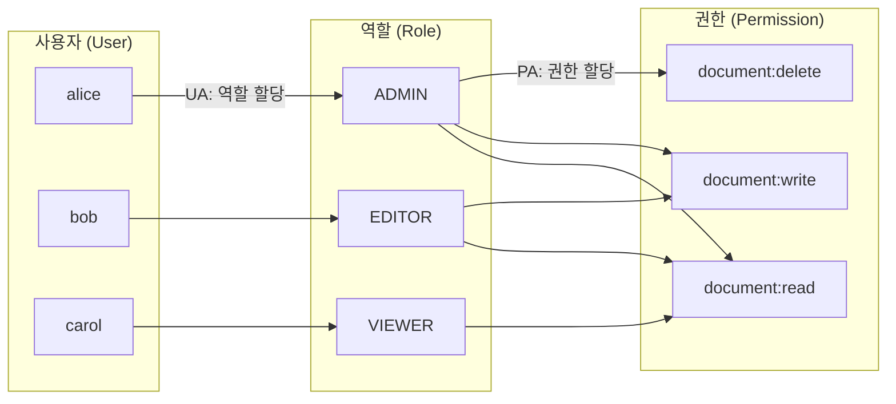
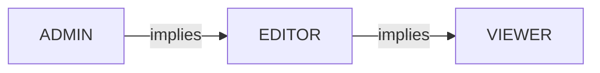
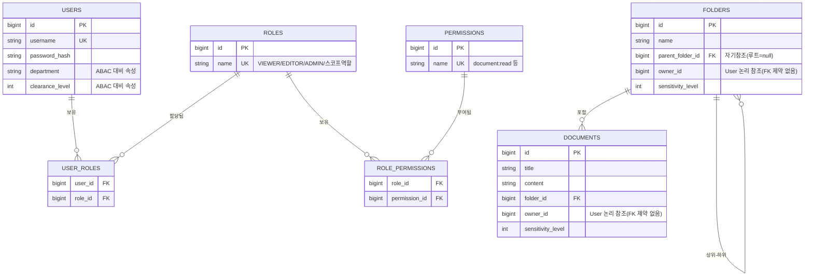
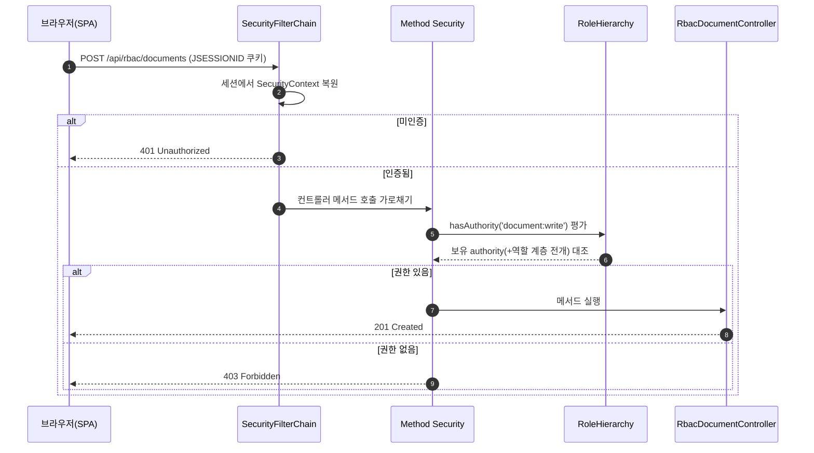
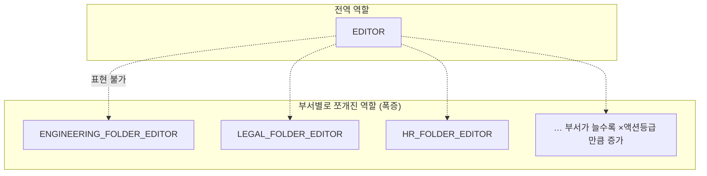

# RBAC (Role-Based Access Control, 역할 기반 접근 제어)

> 이 문서는 본 스터디 프로젝트의 **Stage 1 — RBAC** 구현을 설명합니다.
> 코드와 1:1로 대응하며, 다이어그램은 [mermaid](https://mermaid.js.org/)로 그렸습니다.

---

## 1. RBAC란?

**RBAC**는 사용자에게 권한을 **직접** 부여하지 않고, **역할(Role)** 이라는 중간 계층을 거쳐 부여하는 인가(Authorization) 모델입니다.

- 사용자에게 직접 권한을 주면 `사용자 수 × 권한 수`만큼의 매핑을 관리해야 합니다(관리 폭발).
- 대신 **권한을 역할로 묶고**, 사용자에게는 역할만 할당하면 관리가 단순해집니다.

핵심은 두 개의 할당(assignment)입니다.



- **UA (User-Role Assignment)**: 사용자 ↔ 역할
- **PA (Permission-Role Assignment)**: 역할 ↔ 권한
- 인가 판정은 `사용자 → 역할 → 권한` 경로로 이뤄집니다.

### 핵심 3요소

| 요소 | 의미 | 이 프로젝트 예시 |
|------|------|------------------|
| **User** | 행위 주체 | alice, bob, carol, dave |
| **Role** | 권한의 묶음(직무) | VIEWER, EDITOR, ADMIN |
| **Permission** | 개별 동작 권한 | `document:read`, `document:write`, … |

### 역할 계층 (Role Hierarchy)

상위 역할이 하위 역할의 권한을 **상속**합니다. "ADMIN은 EDITOR가 할 수 있는 모든 것을 할 수 있다"를 한 줄로 표현합니다.



> 참고 — NIST RBAC 모델은 RBAC0(코어) → RBAC1(계층) → RBAC2(제약) → RBAC3(통합)으로 정의됩니다.
> 이 프로젝트는 **RBAC0 + RBAC1(계층)** 까지 구현합니다.

---

## 2. 데이터 모델 (ER 다이어그램)

실제 H2 스키마(Hibernate가 엔티티로부터 생성)를 기준으로 한 ER 다이어그램입니다.
다대다 관계(`User↔Role`, `Role↔Permission`)는 조인 테이블(`user_roles`, `role_permissions`)로 표현됩니다.



**모델 노트**

- `USERS ↔ ROLES`, `ROLES ↔ PERMISSIONS`는 다대다 → 조인 테이블 2개.
- `FOLDERS`는 `parent_folder_id`로 **자기참조 계층**을 가집니다(Stage 3 ReBAC의 전이 권한에서 활용).
- `owner_id`/`department`/`clearance_level`/`sensitivity_level`은 **RBAC에선 아직 쓰지 않습니다**. Stage 2(ABAC)·Stage 3(ReBAC)에서 같은 도메인 위에 활용하려고 미리 둔 속성입니다.
- 역할 계층(VIEWER<EDITOR<ADMIN)은 **DB에 저장하지 않고** `RoleHierarchy` 빈으로 코드에 선언합니다(아래 4장 참고).

---

## 3. 이 프로젝트의 RBAC 구현

### 3.1 권한 카탈로그

```
document:read   document:write   document:delete   document:share
folder:read     folder:write
```

### 3.2 역할 → 권한 매트릭스 (시드)

상위 역할은 하위 역할의 권한을 **모두 펼쳐서** 보유합니다.
(이유: `RoleHierarchy`는 `hasRole`만 전이시키고 `hasAuthority`는 전이시키지 않으므로, 권한 기준 검사를 위해 시드에서 펼쳐 담습니다.)

| 역할 | document:read | document:write | document:delete | document:share | folder:read | folder:write |
|------|:---:|:---:|:---:|:---:|:---:|:---:|
| **VIEWER** | ✅ | | | | ✅ | |
| **EDITOR** | ✅ | ✅ | | | ✅ | ✅ |
| **ADMIN**  | ✅ | ✅ | ✅ | ✅ | ✅ | ✅ |

> 역할 폭발 데모용 **스코프 역할**(`ENGINEERING_FOLDER_EDITOR` 등)은 5장에서 다룹니다.

### 3.3 시드 사용자

| 유저 | 부서 | clearance | 역할 |
|------|------|:---:|------|
| **alice** | ENGINEERING | 5 | ADMIN |
| **bob**   | ENGINEERING | 3 | EDITOR |
| **carol** | LEGAL | 2 | VIEWER |
| **dave**  | ENGINEERING | 3 | EDITOR + LEGAL_FOLDER_EDITOR |

> 모든 시드 유저의 공통 비밀번호는 `password` 입니다(학습용 단순화).

### 3.4 권한이 GrantedAuthority로 변환되는 방식

로그인 시 `User → AppUserDetails` 변환에서 두 종류의 권한 문자열을 노출합니다.

| 출처 | 변환 | 검사식 |
|------|------|--------|
| `Role.name` | `ROLE_` + 이름 (예 `ROLE_EDITOR`) | `hasRole('EDITOR')` |
| `Permission.name` | 원문 그대로 (예 `document:write`) | `hasAuthority('document:write')` |

→ 그래서 컨트롤러에서 `hasRole(...)`과 `hasAuthority(...)`를 **둘 다** 쓸 수 있습니다.

### 3.5 엔드포인트 인가 매트릭스 (`@PreAuthorize`)

| HTTP | 경로 | 필요 권한 | 메모 |
|------|------|-----------|------|
| GET | `/api/rbac/documents` | `hasRole('VIEWER')` | 목록 — **역할 계층**으로 EDITOR/ADMIN도 통과 |
| GET | `/api/rbac/documents/{id}` | `hasAuthority('document:read')` | 단건 |
| POST | `/api/rbac/documents` | `hasAuthority('document:write')` | 생성 |
| PUT | `/api/rbac/documents/{id}` | `hasAuthority('document:write')` | 수정 |
| DELETE | `/api/rbac/documents/{id}` | `hasAuthority('document:delete')` | 삭제 |
| POST | `/api/rbac/documents/{id}/share` | `hasAuthority('document:share')` | 공유(RBAC은 인가만, 실제 관계 저장은 Stage 3) |
| GET | `/api/rbac/documents/decisions` | 인증만 | "왜 허용/거부?" 결정 설명 |
| GET | `/api/rbac/folders` `…/{id}` | `hasAuthority('folder:read')` | |
| POST·PUT | `/api/rbac/folders` `…/{id}` | `hasAuthority('folder:write')` | |
| GET | `/api/rbac/roles` | 인증만 | 역할-권한 매트릭스 + 역할 폭발 지표 |

### 3.6 인가 결정 흐름



핵심: **인증(누구인가)** 은 `SecurityFilterChain`이, **인가(무엇을 해도 되는가)** 는 `@PreAuthorize`(Method Security)가 담당하며, `hasRole` 검사는 `RoleHierarchy` 빈을 통해 상위 역할로 전이됩니다.

---

## 4. 역할 계층은 어떻게 코드에 사는가

`SecurityConfig`에 `RoleHierarchy` 빈 하나만 선언하면, Spring Security 7은 `authorizeHttpRequests`와 메서드 보안(`@PreAuthorize`) **양쪽에 자동 적용**합니다(별도 `MethodSecurityExpressionHandler` 빈 불필요).

```java
@Bean
static RoleHierarchy roleHierarchy() {
    return RoleHierarchyImpl.withDefaultRolePrefix()
            .role("ADMIN").implies("EDITOR")
            .role("EDITOR").implies("VIEWER")
            .build();
}
```

그래서 alice(ADMIN)는 권한 목록에 `ROLE_VIEWER`가 **없어도** `hasRole('VIEWER')`로 보호된 `GET /api/rbac/documents`를 통과합니다.

---

## 5. RBAC의 한계 — 역할 폭발 (Role Explosion)

RBAC는 "**무엇을** 할 수 있는가"는 잘 표현하지만, "**어디서/어떤 조건에서**"는 표현하기 어렵습니다.

예: "엔지니어링 폴더에서만 편집 가능"을 RBAC으로 풀려면, **부서·폴더마다 별도 역할**을 만들어야 합니다.
→ `ENGINEERING_FOLDER_EDITOR`, `LEGAL_FOLDER_EDITOR`, `HR_FOLDER_EDITOR` …



부서 `N`개 × 액션 등급 `M`개면 역할이 **N×M개로 곱하며 증가**합니다.

| 부서 수 | 액션 등급 | 필요한 스코프 역할 수 |
|:---:|:---:|:---:|
| 1 | 3 | 3 |
| 3 | 3 | **9** (현재 시드 기준) |
| 10 | 3 | 30 |
| 50 | 3 | 150 |

`dave`에게 `EDITOR` + `LEGAL_FOLDER_EDITOR`를 함께 붙인 것이 "한 사람에게 역할을 덕지덕지" 붙이는 전형입니다.

> 👉 이 한계가 **Stage 2(ABAC)** 의 동기입니다. ABAC는 "**같은 부서이면 편집 가능**" 같은 **속성 규칙 한 줄**로 위 폭발을 대체합니다.
> 프런트의 `역할/권한` 화면(`/api/rbac/roles`)에 슬라이더 시뮬레이터로 이 폭발을 직접 체험할 수 있습니다.

---

## 6. 코드 위치 (학습용 매핑)

| 개념 | 파일 |
|------|------|
| 도메인(권한/역할/유저) | `backend/.../domain/{Permission,Role,User}.java` |
| 리소스(폴더/문서) | `backend/.../domain/{Folder,Document}.java` |
| 시드(역할→권한 펼침, 유저) | `backend/.../config/DataSeeder.java` |
| 인증 주체 → GrantedAuthority 변환 | `backend/.../security/AppUserDetails.java` |
| 시큐리티 설정·formLogin·RoleHierarchy | `backend/.../security/SecurityConfig.java` |
| 액션↔권한 매핑 | `backend/.../rbac/DocumentAction.java` |
| `@PreAuthorize` 인가 매트릭스 | `backend/.../web/RbacDocumentController.java`, `RbacFolderController.java` |
| "왜 허용/거부" 결정 설명 | `backend/.../rbac/AccessDecisionExplainer.java` |
| 역할 폭발 지표 | `backend/.../rbac/RbacRoleService.java`, `web/RbacAdminController.java` |
| 허용/거부·계층 테스트 | `backend/src/test/.../rbac/RbacAuthorizationTest.java` |

---

## 7. 직접 해보기

```bash
# 백엔드 (전역 java 없음 → 환경변수 export)
export JAVA_HOME=/opt/homebrew/opt/openjdk@21/libexec/openjdk.jdk/Contents/Home
export PATH="/opt/homebrew/opt/openjdk@21/bin:$PATH"
cd backend && ./gradlew bootRun      # :8080

# 프런트 (다른 터미널)
cd frontend && npm run dev            # :5173 (/api 프록시 → :8080)
```

**시나리오**: `:5173`에서 유저를 **carol(VIEWER) → bob(EDITOR) → alice(ADMIN)** 으로 전환하며 같은 문서에 읽기/수정/삭제/공유를 시도해 보세요.

| 유저 | 읽기 | 수정 | 삭제 | 공유 |
|------|:---:|:---:|:---:|:---:|
| carol (VIEWER) | ✅ 200 | ⛔ 403 | ⛔ 403 | ⛔ 403 |
| bob (EDITOR) | ✅ 200 | ✅ 200 | ⛔ 403 | ⛔ 403 |
| alice (ADMIN) | ✅ 200 | ✅ 200 | ✅ 204 | ✅ 200 |

`RBAC 데모` 화면의 **결정 표(이론)** 와 **라이브 시도(실제 HTTP 상태)** 가 일치하는지 확인하면 RBAC의 동작을 가장 빠르게 체득할 수 있습니다.
```bash
# 빠른 확인용 curl
curl -s -c /tmp/c.txt -d "username=carol&password=password" http://localhost:8080/api/login
curl -s -b /tmp/c.txt -o /dev/null -w "VIEWER 삭제 시도 → HTTP %{http_code}\n" \
  -X DELETE http://localhost:8080/api/rbac/documents/1   # → 403
```
